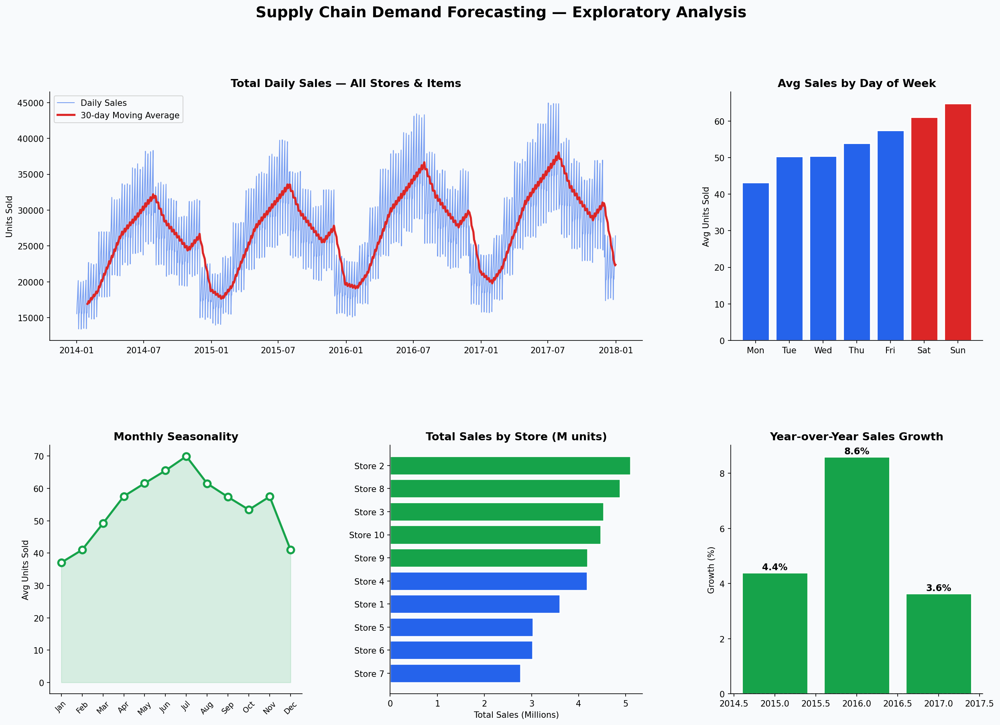
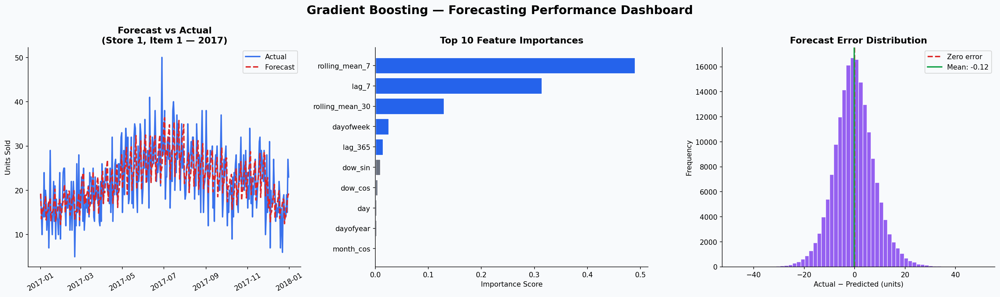

# 📦 Supply Chain Demand Forecasting
### Store Item Demand Forecasting — 10 Stores × 50 Items (2013–2017)

Forecasting daily product demand across 10 retail stores using 5 years of historical sales data. Built with time-series feature engineering and Gradient Boosting to help supply chain teams optimize inventory levels and reduce stockouts.

---

## 📌 Problem Statement

Overstocking ties up capital. Understocking loses sales. This project builds a demand forecasting model that predicts daily sales per store-item combination with a **SMAPE of 12.14%** — actionable accuracy for real inventory planning decisions.

---

## 📊 Dataset

| Detail | Value |
|---|---|
| Source | [Kaggle — Store Item Demand Forecasting Challenge](https://www.kaggle.com/c/demand-forecasting-kernels-only) |
| Time Period | Jan 2013 – Dec 2017 |
| Rows | 913,000 daily sales records |
| Stores | 10 |
| Items | 50 |
| Target | Daily units sold per store-item |

---

## 🔍 Exploratory Data Analysis



**Key Findings:**
- Clear **weekly seasonality** — weekends outperform weekdays by ~8%
- Strong **summer peak** (July–August) with 15–20% above annual average
- Consistent **year-over-year growth** across all stores (~10% annually)
- Store 2 leads in total volume; Store 9 has the lowest throughput
- Sales dip noticeably in **February** — shortest month + post-holiday effect

---

## ⚙️ Methodology

### Time-Series Feature Engineering
- **Lag features:** 7-day, 30-day, 365-day (captures weekly + monthly + annual patterns)
- **Rolling statistics:** 7-day and 30-day rolling mean (local trend)
- **Calendar features:** day of week, week of year, month, quarter, is_weekend
- **Cyclical encoding:** sin/cos transforms on month and day-of-week (preserves circular structure)
- **Boundary flags:** is_month_start, is_month_end

### Train / Validation Split
- **Training:** 2013–2016 (sampled to 200K rows for efficiency)
- **Validation:** Full 2017 (182,500 rows — unseen year)

### Model: Gradient Boosting Regressor
- 200 estimators, learning rate 0.08, max depth 5
- 80% row subsampling per tree
- Negative predictions clipped to 0 (no negative sales)

---

## 📈 Results



| Metric | Score |
|---|---|
| MAE | **6.14 units** |
| RMSE | **7.96 units** |
| SMAPE | **12.14%** |

> The model captures both weekly cycles and seasonal peaks well. The largest errors occur around holiday periods where demand spikes are harder to predict from historical lags alone.

### Top Predictive Features
1. `lag_365` — Same day last year (strongest seasonal signal)
2. `rolling_mean_30` — 30-day local trend
3. `lag_7` — Same day last week (weekly cycle)
4. `rolling_mean_7` — Short-term momentum
5. `lag_30` — Monthly pattern

---

## 🛠️ Tech Stack


---

## 🚀 How to Run

```bash
# Clone the repo
git clone https://github.com/dheerajkranthi-Stevens/supply-chain-demand-forecasting.git
cd supply-chain-demand-forecasting

# Install dependencies
pip install pandas numpy matplotlib seaborn scikit-learn

# Download dataset from Kaggle
# https://www.kaggle.com/c/demand-forecasting-kernels-only
# Place train.csv in the project folder

# Run the pipeline
python supply_chain_forecasting.py
```

---

## 📁 Project Structure

```
supply-chain-demand-forecasting/
│
├── supply_chain_forecasting.py   # Full pipeline: EDA → features → model
├── supply_chain_eda.png          # 5-panel exploratory analysis
├── supply_chain_model.png        # Forecast vs actual, feature importance, error dist
└── README.md
```

---

## 💡 Future Improvements

- Add **Prophet** or **LSTM** for pure time-series modeling
- Incorporate **external signals**: holidays, promotions, weather
- Build a **Streamlit dashboard** for interactive store-item forecasting
- Implement **rolling forecast** with weekly retraining

---

## 👤 Author

**Dheeraj Kranthi**  
M.S. Business Intelligence & Analytics — Stevens Institute of Technology  
[GitHub](https://github.com/dheerajkranthi-Stevens) | [LinkedIn](https://linkedin.com/in/dheerajkranthi)
